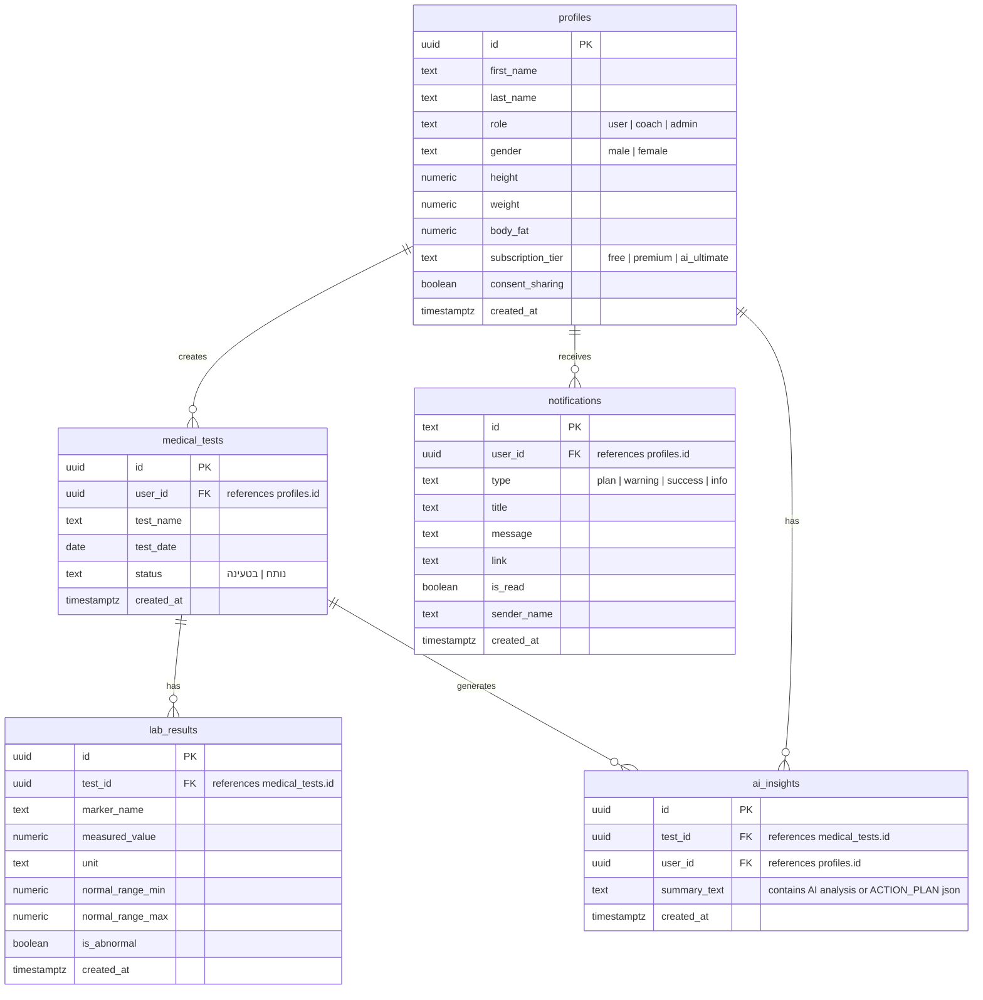

<div dir="rtl">

&rlm;# 🧬 OptiLife - מרחב בריאות אישי ומאמן AI

&rlm;**קישור לפרויקט החי ב-Vercel:** [optilife-psi.vercel.app](https://optilife-psi.vercel.app)  
&rlm;**קורס:** פיתוח מוצר מבוסס AI - פרויקט גמר  
&rlm;**מגיש:** דביר דניאל

---

&rlm;## 📝 סקירה כללית
&rlm;**OptiLife** היא פלטפורמה רפואית-תזונתית מבוססת בינה מלאכותית (AI) המאפשרת למשתמשים להעלות צילומי בדיקות מעבדה (בדיקות דם), לנתח אותם באופן מיידי, לעקוב אחר מגמות המדדים שלהם לאורך זמן, ולקבל תוכניות תזונה וכושר מותאמות אישית.  
&rlm;המערכת משלבת ממשק ייחודי דו-כיווני המאפשר ללקוחות לשתף את מדדיהם עם צוות מלווה (מאמנים ותזונאים) לצורך מעקב וקבלת הנחיות מותאמות בזמן אמת.

---

&rlm;## 🎯 הבעיה שהפרויקט פותר (הכאב)
&rlm;תוצאות בדיקות דם הן לרוב אוסף של מונחים רפואיים קשים להבנה וטווחי מספרים מבלבלים. אנשים רבים נאלצים להמתין שבועות לתור אצל רופא משפחה או תזונאי רק כדי להבין "מה אומרות התוצאות" וכיצד עליהם לפעול כדי לשפר אותן.  
&rlm;**OptiLife פותרת את הכאב הזה בשלושה שלבים:**
1. **הנגשה מיידית:** תרגום בדיקת הדם המסובכת לשפה פשוטה וברורה בעברית.
2. **פרקטיקה מעשית:** ה-AI מתרגם את החריגות בדם למרשם תזונתי וספורטיבי ברור (Action Plan).
3. **ליווי מקצועי מתמשך:** פתרון הנתק בין המטופל למלווה המקצועי שלו על ידי מתן לוח בקרה מאובטח למאמנים.

---

&rlm;## 👥 קהל היעד
* **מתאמנים ואנשים השואפים לאורח חיים בריא:** המעוניינים לשפר רמות אנרגיה, לאזן מדדים (כמו כולסטרול או סוכר) ולבצע אופטימיזציה לגופם.
* **מטופלים עם חוסרים תזונתיים:** אנשים הסובלים מאנמיה, חוסר בויטמין D וכדומה, הזקוקים למעקב סדיר ותוכניות ממוקדות.
* **מאמנים, תזונאים ואנשי מקצוע:** הזקוקים לכלי מרכזי ומאובטח למעקב אחר בדיקות הדם של הלקוחות שלהם ושליחת הנחיות מותאמות.

---

&rlm;## ⚔️ מתחרים ובידול
* **קופות החולים (אפליקציות רשמיות):** מציגות רק את טווחי הנורמה ללא כל הסבר תזונתי או המלצה לפעולה.
* **מחשבוני בריאות אינטרנטיים:** דורשים הקלדה ידנית מייגעת של כל המדדים, אינם שומרים היסטוריה ואינם מציעים ניתוח AI מבוסס תמונה.
* **בידול ה-WOW של OptiLife:**
  1. &rlm;**OCR וניתוח תמונה רב-ממדי (Gemini AI):** סריקה ישירה של הבדיקה ללא הקלדה.
  2. **מנוע המלצות כפול:** הפקה אוטומטית של תוכנית אימונים (Fitness) ותפריט (Nutrition) בהתאמה אישית למדדים החריגים.
  3. **צ'אט מאמן AI אישי:** עם זיכרון היסטוריית השיחה והבנה קלינית של מדדי הדם הספציפיים של המשתמש.
  4. &rlm;**לוח בקרה למאמנים (B2B):** חיבור אנושי דו-כיווני מאובטח.
  5. **עיצוב להדפסה (Print Optimization):** אפשרות להפיק את תוכנית הפעולה כדו"ח רפואי מעוצב להדפסה פיזית לרופא המשפחה.

---

&rlm;## 🗺️ תרשים ERD (מודל הנתונים ב-Supabase)

&rlm;מודל הנתונים מתוכנן בצורה קשרים (Relational Database) המאפשרת שמירה על שלמות הנתונים ואבטחתם:

<div dir="ltr">



</div>

---

&rlm;## 🔒 אבטחת מידע ופרטיות (Row Level Security - RLS)
&rlm;בדיקות רפואיות הן מידע רגיש ביותר. המערכת מיושמת עם הגנות RLS מחמירות ב-Supabase:
1. **טבלאות משתמשים:** משתמש קצה מורשה לקרוא ולכתוב **רק** את הרשומות המשויכות ל-`user_id` שלו.
2. **אישור שיתוף (Consent-Based Access):** מלווים מקצועיים (מאמנים) מורשים לקרוא תוצאות של לקוחות בטבלאות `medical_tests` ו-`lab_results` אך ורק אם המטופל אישר זאת במפורש (`consent_sharing = true` בפרופיל שלו).
3. &rlm;**MFA (אימות דו-שלבי):** תשתית מובנית להפעלת אימות דו-שלבי מול אפליקציות Authenticator (לצרכי הגשה הוספנו כפתור מעקף מהיר לפיתוח בהגדרות החשבון).
4. **אבטחת מפתחות API (סודיות השרת):** מפתחות ה-API של Gemini מוסתרים בשרת בתוך **Vercel Serverless Functions** (בתיקיית `/api`). מפתח ה-API אינו חשוף לעולם בדפדפן הלקוח!

---

&rlm;## 🔌 רשימת שירותים חיצוניים ואינטגרציות

| שירות | סוג | למה משמש |
| :--- | :--- | :--- |
| **Supabase Database** | בסיס נתונים SQL | שמירת פרופילים, תוצאות מעבדה, תוכניות טיפול והתראות. |
| **Supabase Auth** | אוטנטיקציה | הרשמה, התחברות מאובטחת, איפוס סיסמאות וניהול סשנים. |
| **Google OAuth** | הזדהות חיצונית | התחברות מהירה ומאובטחת באמצעות חשבון Google של המשתמש. |
| **Google Gemini API** | מנוע AI | ניתוח ה-OCR של בדיקת הדם, השוואה היסטורית, כתיבת המלצות וניהול צ'אט הליווי (מאמן). |
| **Vercel Serverless Functions** | לוגיקת שרת | תיווך מאובטח לקריאות ה-API של Gemini מבלי לחשוף את מפתחות הגישה. |
| **Stripe Payments** | סליקה ותשלומים | מעבר לחבילות פרימיום באמצעות Stripe Payment Links (במצב Test Mode להצגה). |

---

&rlm;## ⚙️ הוראות הרצה ופיתוח מקומי
&rlm;כדי להריץ את הפרויקט על המחשב שלך:

1. **שכפול הפרויקט:**
<div dir="ltr">

```bash
git clone <repository-url>
cd optilife
```

</div>

2. **התקנת תלויות:**
<div dir="ltr">

```bash
npm install
```

</div>

3. **הגדרת קובץ משתני סביבה:**  
   צור קובץ בשם `.env` בתיקיית השורש והזן את המשתנים הבאים:
<div dir="ltr">

```env
VITE_SUPABASE_URL=your_supabase_url
VITE_SUPABASE_ANON_KEY=your_supabase_anon_key
VITE_GEMINI_API_KEY=your_gemini_api_key
```

</div>

4. **הרצה מקומית (שרת פיתוח):**
<div dir="ltr">

```bash
npm run dev
```

</div>

   *הערה: לפיתוח מקומי מאובטח עם ה-Serverless Functions של Vercel, מומלץ להריץ באמצעות ה-Vercel CLI:*
<div dir="ltr">

```bash
vercel dev
```

</div>

---

&rlm;## 🧠 תיאור תהליך הפיתוח (Vibe Coding / AI Collaboration)
&rlm;הפרויקט פותח בשיתוף פעולה הדוק עם סוכן ה-AI **Antigravity**.  
* **שלב התכנון:** ה-AI עזר לגבש את מודל הנתונים ב-Supabase ואת ה-Flow של קריאות ה-Gemini כדי לקבל תשובות בפורמט JSON תקני וקבוע.
* **שלב פיתוח חוויית המשתמש:** בניית הגרפים הדינמיים (SVG מחושב בזמן אמת) ועיצוב דוח ההדפסה בוצעו באמצעות איטרציות מהירות מול ה-AI כדי להגיע לרמת פוליש גבוהה.
* **שלב האבטחה (Refactoring ל-Production):** ה-AI ביצע ארגון מחדש (Refactoring) לקוד והעביר את כל קריאות ה-API הרגישות לשרת (Serverless) כדי למנוע חשיפת מפתחות באבטחת מידע – מה שהביא את האפליקציה לרמה הנדרשת לקבלת ציון מצוינות בונוס.

</div>
