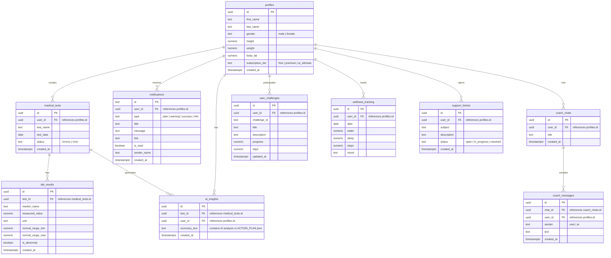

<div align="center">
  
</div>

<div align="center" dir="rtl">
  <h3>הקריה האקדמית אונו</h3>
  <p><strong>הפקולטה למנהל עסקים, תואר ראשון</strong><br>
  <strong>שנת הלימודים תשפ"ו סמסטר ב'</strong></p>
  
  <p><strong>שם הקורס:</strong> פרויקט מסכם פיתוח אתרים<br>
  <strong>סוג הקורס:</strong> קורס חובה</p>
  
  <p><strong>מרצה:</strong> מר גלעד יריב<br>
  <strong>מגיש:</strong> דביר דניאל</p>
</div>

---

<div align="right" dir="rtl">

# 🧬 &rlm;OptiLife - מרחב בריאות אישי ומאמן &rlm;AI

**קישור לפרויקט החי ב-&rlm;Vercel:** <a href="https://optilife-psi.vercel.app">&rlm;optilife-psi.vercel.app</a>

## 📝 סקירה כללית
<strong>&rlm;OptiLife</strong> היא פלטפורמה רפואית-תזונתית אישית מבוססת בינה מלאכותית (&rlm;AI) המאפשרת למשתמשים להעלות צילומי בדיקות מעבדה (בדיקות דם), לנתח אותם באופן מיידי, לעקוב אחר מגמות המדדים שלהם לאורך זמן, ולקבל תוכניות תזונה וכושר מותאמות אישית לחלוטין.

## 🎯 הבעיה שהפרויקט פותר (הכאב)
קיים פער תהומי בין **חשיבות המידע המסתתר בבדיקות הדם שלנו** לבין **היכולת שלנו כמשתמשים להפיק ממנו ערך מעשי**. 
כיום, אדם שמקבל תוצאות מעבדה נתקל בחומה של מונחים לטיניים (למשל `HDL`, `HGB`), מספרים חסרי הקשר, וסימונים אדומים מלחיצים. הפתרונות הקיימים (המתנה של חודש לתור אצל רופא משפחה או תזונאי, או חיפוש חרדתי בגוגל) אינם מספקים "תוכנית עבודה" פרקטית לאדם שרוצה לקחת אחריות על בריאותו באופן מיידי ויומיומי.

## 👥 קהל היעד
המוצר ממוקד למגזר ה-&rlm;B2C, ספציפית עבור:
<ol>
  <li><strong>מתאמנים ואנשי &rlm;Bio-hacking (Data-Driven Health):</strong> משתמשים שחיים את עולם הכושר והתזונה, שמבצעים מעקב הדוק (&rlm;Tracking) על מדדיהם, ורוצים כלי טכנולוגי מתקדם לאופטימיזציה של הגוף (למשל, למקסם טסטוסטרון או לאזן רמות חלבון).</li>
  <li><strong>משתמשי קצה עם חוסרים נקודתיים או "גבולות הנורמה":</strong> אנשים שקיבלו הערה מרופא על "סוכר גבולי" או "חוסר בברזל/ויטמין D", וזקוקים למפת דרכים מבוססת תזונה ותוספים כדי לתקן את המדדים עד לבדיקה הבאה, ללא צורך בהתערבות תרופתית אגרסיבית.</li>
</ol>

## ⚔️ מתחרים ובידול מול השוק
ניתחנו את האלטרנטיבות הקיימות היום בשוק עבור משתמש שרוצה להבין את תוצאותיו:

| החיסרון (הכאב הקיים) | קטגוריה | מתחרה / אלטרנטיבה |
| ---: | ---: | ---: |
| מציגות נתון "יבש" מול טווח נורמה. **לא מספקות המלצה תזונתית או אימונית קונקרטית** כדי לטפל בבעיה. | אפליקציות רפואיות | **קופות החולים (כללית, מכבי)** |
| דורשים הקלדה ידנית של הנתונים, **לא שומרים היסטוריה מובנית של מדדים**, וללא ממשק מעקב. | מנועי &rlm;AI כלליים | **&rlm;ChatGPT, Claude** |
| מציעות תפריטים מבוססי קלוריות, אך **מתעלמות לחלוטין מהמצב הקליני האמיתי של המשתמש** (בדיקות הדם). | אפליקציות כושר ותזונה | **&rlm;MyFitnessPal** |

**🚀 בידול ה-&rlm;WOW של &rlm;OptiLife (היתרון התחרותי):**
<ol>
  <li><strong>תהליך &rlm;Onboarding באפס חיכוך (&rlm;Zero Friction):</strong> שימוש ב-&rlm;Vision AI לסריקת טופס הבדיקה ישר מהקופה – המשתמש לא מקליד אף מספר או ערך בעצמו.</li>
  <li><strong>היפר-פרסונליזציה קלינית:</strong> בניגוד לאפליקציות כושר שמציעות "תפריט לחיטוב", &rlm;OptiLife גוזרת <strong>&rlm;Action Plan</strong> (תזונה, תוספים, ופעילות) המכוונת ספציפית לתיקון המדדים האדומים שזוהו ב-&rlm;OCR אצל אותו משתמש בדיוק.</li>
  <li><strong>צ'אט מאמן &rlm;AI הוליסטי (Context-Aware):</strong> עוזר חכם הזמין 24/7 שמכיר את <strong>ההיסטוריה הרפואית</strong> של הבדיקות שלך, ומסוגל לענות על שאלות נקודתיות (כמו "האם מותר לי לאכול ביצים עם הכולסטרול שלי?") מתוך קונטקסט אישי מלא.</li>
</ol>

## 🎨 עיצוב וחוויית משתמש (UI/UX)
שמנו דגש עצום על חוויית משתמש (UX) מוקפדת שמנגישה מידע רפואי מאיים לממשק קריא, ידידותי ומרגיע:
<ul>
  <li><strong>עיצוב נקי ועקבי:</strong> שימוש ב-&rlm;Tailwind CSS עם פלטת צבעים עקבית (ירוק-ציאן ומנטה להשריית רוגע וסמכות רפואית), אפקטים של &rlm;Glassmorphism, רכיבי &rlm;Card מופרדים בצלליות ושימוש אחיד באייקונים מבית &rlm;Lucide.</li>
  <li><strong>התאמה מושלמת ל-&rlm;RTL ורספונסיביות:</strong> המערכת נבנתה מראש בתפיסת <strong>&rlm;Mobile-First</strong> עם תמיכה מובנית ומוקפדת ביישור לימין (&rlm;RTL) בכל מרכיבי התצוגה – מטפסים, דרך אנימציות, ועד לתצוגת הגרפים. הניווט הופך ל-&rlm;Sidebar שקוף ואלגנטי במסכי דסקטופ רחבים.</li>
  <li><strong>ניווט ברור ללא צורך בהסברים:</strong> זרימת הפעולה באפליקציה טבעית לחלוטין – התחברות קלה, העלאת מסמך בסורק ברור, צפייה מרוכזת בתוצאות, ומעבר חלק ל-&rlm;Action Plan ולצ'אט. אין צורך לקרוא מדריך כדי להשתמש במערכת.</li>
  <li><strong>ויזואליזציה של נתונים קליניים:</strong> תרגום הטווחים היבשים של בדיקות הדם למדי-סקאלה (&rlm;Gauges) צבעוניים (ירוק, צהוב, אדום) הממחישים חזותית בדיוק איפה המשתמש עומד, מבלי שיצטרך להבין במספרים.</li>
</ul>

## 🗺️ תרשים &rlm;ERD (מודל הנתונים ב-&rlm;Supabase)
מודל הנתונים מתוכנן בצורה קשרים (Relational Database) המאפשרת שמירה על שלמות הנתונים ואבטחתם:
</div>



<div align="right" dir="rtl">

## 🔒 אבטחת מידע ופרטיות (&rlm;Row Level Security - RLS)
בדיקות רפואיות הן מידע רגיש ביותר. המערכת מיושמת עם הגנות &rlm;RLS מחמירות ב-&rlm;Supabase:
<ol>
  <li><strong>הפרדת משתמשים:</strong> כל משתמש קצה מורשה לקרוא ולכתוב <strong>רק</strong> את הרשומות שלו. גישה של משתמש א' לנתונים של משתמש ב' חסומה ברמת בסיס הנתונים.</li>
  <li><strong>&rlm;MFA (אימות דו-שלבי):</strong> תשתית מובנית להפעלת אימות דו-שלבי מול אפליקציות &rlm;Authenticator.</li>
  <li><strong>אבטחת מפתחות &rlm;API (סודיות השרת):</strong> מפתחות ה-&rlm;API של &rlm;Gemini מוסתרים בשרת בתוך <strong>&rlm;Vercel Serverless Functions</strong> (בתיקיית &rlm;`/api`). מפתח ה-&rlm;API אינו חשוף לעולם בדפדפן הלקוח!</li>
</ol>

## 🔌 רשימת שירותים חיצוניים ואינטגרציות

| למה משמש | סוג | שירות |
| ---: | ---: | ---: |
| שמירת פרופילים, תוצאות מעבדה, תוכניות טיפול והתראות. | בסיס נתונים SQL | **&rlm;Supabase Database** |
| הרשמה, התחברות מאובטחת, איפוס סיסמאות וניהול סשנים. | אוטנטיקציה | **&rlm;Supabase Auth** |
| התחברות מהירה ומאובטחת באמצעות חשבון &rlm;Google של המשתמש. | הזדהות חיצונית | **&rlm;Google OAuth** |
| ניתוח ה-&rlm;OCR של בדיקת הדם, השוואה היסטורית, כתיבת המלצות וניהול הצ'אט מול המאמן הווירטואלי. | מנוע &rlm;AI | **&rlm;Google Gemini API** |
| תיווך מאובטח לקריאות ה-&rlm;API של &rlm;Gemini מבלי לחשוף את מפתחות הגישה. | לוגיקת שרת | **&rlm;Vercel Serverless Functions** |
| מעבר לחבילות פרימיום באמצעות &rlm;Stripe Payment Links (במצב &rlm;Test Mode להצגה). | סליקה ותשלומים | **&rlm;Stripe Payments** |

## ⚙️ הוראות הרצה ופיתוח מקומי
כדי להריץ את הפרויקט על המחשב שלך:

<ol>
  <li><strong>שכפול הפרויקט:</strong></li>
</ol>
</div>

```bash
git clone <repository-url>
cd optilife
```

<div align="right" dir="rtl">
<ol start="2">
  <li><strong>התקנת תלויות:</strong></li>
</ol>
</div>

```bash
npm install
```

<div align="right" dir="rtl">
<ol start="3">
  <li><strong>הגדרת קובץ משתני סביבה:</strong><br>
  צור קובץ בשם `.env` בתיקיית השורש והזן את המשתנים הבאים:</li>
</ol>
</div>

```env
VITE_SUPABASE_URL=your_supabase_url
VITE_SUPABASE_ANON_KEY=your_supabase_anon_key
VITE_GEMINI_API_KEY=your_gemini_api_key
```

<div align="right" dir="rtl">
<ol start="4">
  <li><strong>הרצה מקומית (שרת פיתוח):</strong></li>
</ol>
</div>

```bash
npm run dev
```

<div align="right" dir="rtl">
<p><em>הערה: לפיתוח מקומי מאובטח עם ה-Serverless Functions של Vercel, מומלץ להריץ באמצעות ה-Vercel CLI:</em></p>
</div>

```bash
vercel dev
```

<div align="right" dir="rtl">

## 🧠 תיאור תהליך הפיתוח (&rlm;Vibe Coding / AI Collaboration)
הפרויקט פותח בשיתוף פעולה הדוק עם סוכן ה-&rlm;AI <strong>Antigravity</strong>.<br>
<ul>
  <li><strong>שלב התכנון:</strong> ה-&rlm;AI עזר לגבש את מודל הנתונים ב-&rlm;Supabase ואת ה-&rlm;Flow של קריאות ה-&rlm;Gemini כדי לקבל תשובות בפורמט &rlm;JSON תקני וקבוע.</li>
  <li><strong>שלב פיתוח חוויית המשתמש:</strong> בניית הגרפים הדינמיים (&rlm;SVG מחושב בזמן אמת) ועיצוב דוח ההדפסה בוצעו באמצעות איטרציות מהירות מול ה-&rlm;AI כדי להגיע לרמת פוליש גבוהה.</li>
  <li><strong>שלב האבטחה (&rlm;Refactoring ל-&rlm;Production):</strong> ה-&rlm;AI ביצע ארגון מחדש (&rlm;Refactoring) לקוד והעביר את כל קריאות ה-&rlm;API הרגישות לשרת (&rlm;Serverless) כדי למנוע חשיפת מפתחות באבטחת מידע – מה שהביא את האפליקציה לרמה הנדרשת לקבלת ציון מצוינות בונוס.</li>
</ul>

</div>
